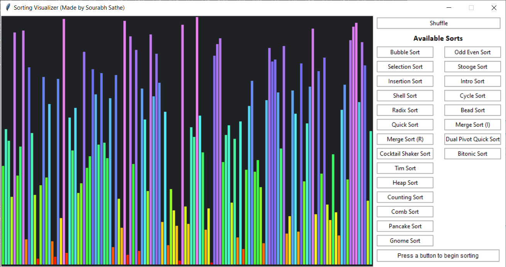
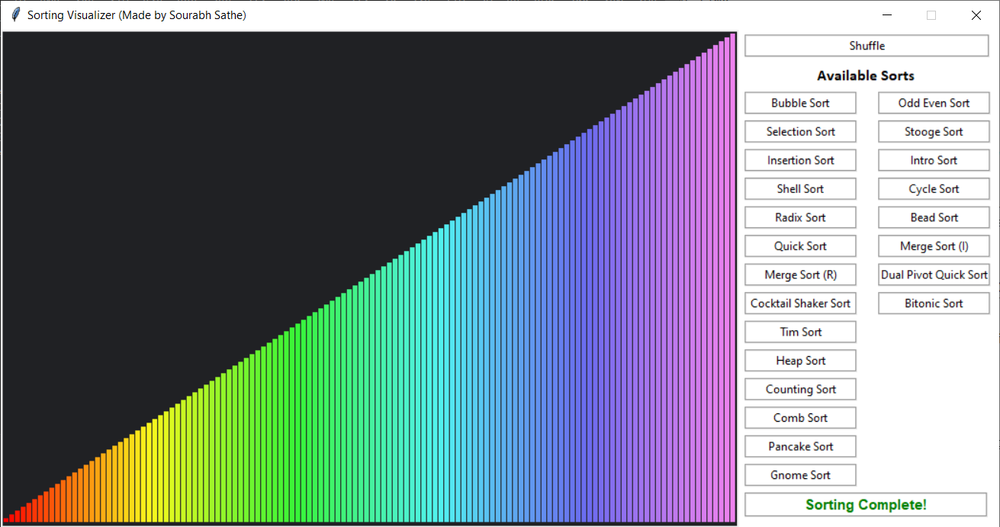

# Sorting Visualizer GUI

Python app that visually shows how different sorting algorithms work.

Made in python using `Tkinter` module.

Before sorting

After sorting

### Python Dependencies:

-   [`colour` library](https://pypi.org/project/colour/) (For rainbow gradient)

Install the above python dependency using the following command

    pip install -r requirements.txt
